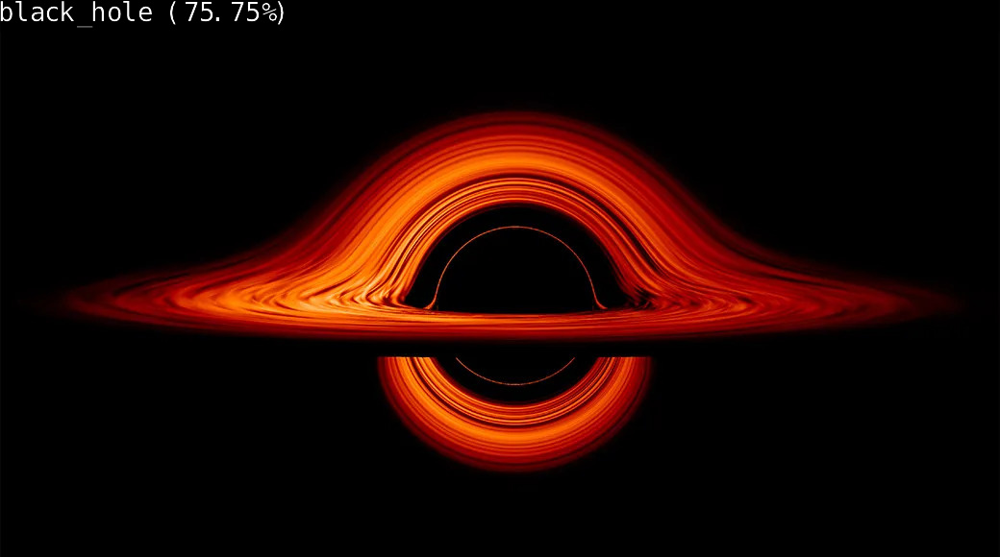

# Project Name

This Project is an AI classification model on celestial objects in space. It was designed to run on an nvidia orin nano.

[Uses Spacenet dataset from kaggle](https://www.kaggle.com/datasets/razaimam45/spacenet-an-optimally-distributed-astronomy-data)

## The Algorithm

First Deletes all existing files in the image folder to keep storage
Second, the code creates a web server using flask, and can be accessed on any browser using the IP address of the nano, and the standard 5000 port.
The code then prompts the user for an input image using a combination of HTML and CSS to build and prompt the user
Checks using basic python string commands, if the image is a jpg, png, or jpeg, if none, it doesnt do anything and returns to start screen
With the image, the code runs the classification model to see what the image is
Once it has classified, it adds a text overlay to the original image, so that the text is a part of the new image
Then returns the image to the web server with a new web page added for cleaner experience for user

## Running this project

1. First run pip install flask in the command terminal
2. Next run python/python3 AI.py
3. Once this happens, you may be prompted with a window to open the server in your browser, click it
4.  If no window is opened, you must go to the browser yourself and type any of the http addresses yourself and hit enter
5.  Enter an image file when prompted (jpg, jpeg, or PNG only) and hit upload
6.  Wait and see the image that is added to the webpage, once classification is done
7.  Optional: Click upload another
   

[Video showing complete runthrough of how to run the code](https://youtu.be/5nkTpQ6OKjc)
